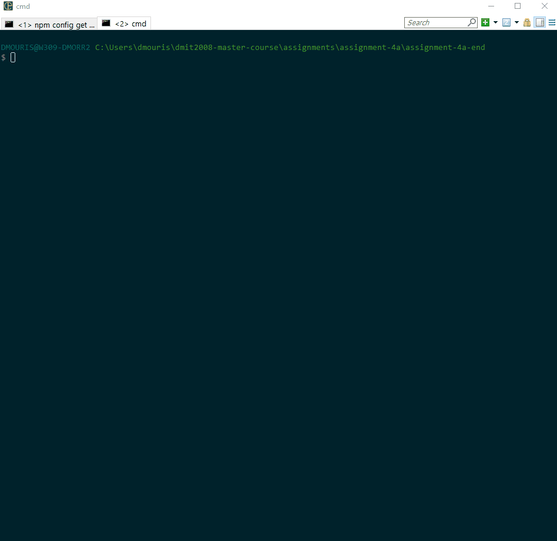

# Assignment 4a - Reimplementing our Job Board with React

This assignment will test your knowledge of using REST APIs in a React application, and also your ability to use React effects to manage side effects in your application and load data.

You will be assessed on your knowledge of the following:

- using lifted state in react components
- using React effects to manage side effects
- making requests to a REST API in a next.js application.
- managing the state of the result of rest API calls

**IMPORTANT NOTE**: this project will be using a similar backend to assignment 1 except it was implemented as part of the `next.js pages/api` folder which are endpoints that run from the same domain as the frontend. Please refer to the [backend documentation for the endpoints](./prisma-backend-tools/README.md).

## Steps
1. Read the backend documentation to understand the endpoints that are available to you here [backend documentation for the endpoints](./prisma-backend-tools/README.md).
   - If you are having trouble with the backend please use `npm run generate-db`.

2. In your `index.js` file in the `pages` folder import the `useEffect` and `useState` hooks from react. Create an effect that will make a request to `jobs` endpoint and store the result in a state variable, this effect should only fire once when the component is mounted.
   - All of the REST API calls that you make should be in functions stored in a `utils/api/jobs.js` file.
   - The domain of the API should be explicity set in the `utils/api/jobs.js` file as `BASE_URL` and exported for use in the tests (for them to run properly).

Once done, replace the existing `availableJobs` variable with your new state variable and delete the `availableJobs` initialization (it's no longer needed).

3. Handle the loading state of the request with a loading spinner in place of the `AvailableJobList` component.

4. Inside the `JobItem` component, create a button that will allow the user to apply for the job (see the `CardActions` component). When the user clicks on the button, make a post request to the `saved-job` endpoint with the correct jobId.
   - Review the documntation for [fetch](https://developer.mozilla.org/en-US/docs/Web/API/Fetch_API/Using_Fetch) if necessary.
   - Once the job is saved, the button should be disabled and the text should change to "Saved". Please review the "Expected Output/Functionality" section for more details on this.
   - Since the above step requires you to change the state of the job, you'll need a stateful variable to disable the button. You will also need to update the state of the saved jobs in the `index.js` file in the `pages` folder.
   - Hint: you might need to use a ternary here.

6. In the `index.js` file in the `pages` folder, create an effect that will make a request to the `saved-jobs` endpoint and store the result in a state variable, this effect should only fire once when the component is mounted. The state for the `savedJobs` should be passed down to the `JobItem` component.
    - Hint: you'll need to modify your `AvailableJobList` component for the state to be passed properly down.
7. In the `JobItem` component **write an effect that will listen to the changes of the "saved jobs" prop you passed down**. In the effect, set the stateful variable you created in step 4 to true if the job is saved.
- If you refresh the page the jobs should still be saved.

## Expected Output/Functionality

### Removing saved jobs from the database
If you want to delete saved jobs from the database please look below

## Bonus (only attempt this if you are done with the above steps)

1. [use context to manage the state of the jobs](https://react.dev/learn/passing-data-deeply-with-context) (rather than propdrillinger) so that you don't have to pass `savedJobs` and `setSavedJobs` down to the `JobItem` component.

## Challenges (only attempt this if you have way too much time on your hands)
1. Rewrite this project using `react-query` and `Suspense` to make requests and handle the state of the project.

2. Write the server-side handler for a delete request for the saved jobs and update the state of the saved jobs.

Note: these are challenges for you to try on your own if you don't find the assignments challenging enough. Please don't ask your instructor for help on these.

## Marking Key

| Marks | Tasks |
|------------------|------------------|
| 3 | State used correctly in the `index.js` form component. This includes proper imports, properly controlling inputs and initializing with the correct values. |
| 3 | All fetching functions are stored in `utils/api/jobs.js` are exported properly alongside the domain `BASE_URL` (needed for tests) |
| 5 | Effect in the `index.js` is implemented correctly, and uses the correct dependency array. Effect should fetch the jobs and saved jobs and store them to the state. |
| 5 | The component `JobItem` posts to the backend properly, and disables the button and has correct functionality |
| 5 | Saved jobs loaded succesfully from the backend and the component `JobItem` uses an effect which listens to the `savedJobs` prop which disables the button on load. | 
| -5 | Project runs without errors, and functionality looks like the images provided. |
| -3 | Code is clean and well-organized, and components created in the right location |

## Marking Rubric
### 5 marks
| Marks | 5 marks Criteria |
|------------------|------------------|
| 5 | Task was completed with the highest of proficiency adhering to best practices and followed subject matter guidelines all tasks were completed to a professional standard. |
| 4 | Task was completed well some minor mistakes. Well above average work shows good understanding of the task and high degree of competence |
| 3  | Satisfactory work some features missing or incorrectly implemented. Show a moderate level of understanding in the task with room for improvement. |
| 2  | Below average work. Task was poorly complete. Show understanding of the task and the requirements to implement but implementation was poorly executed. |
| 1  | Some of the task was completed. Showed a lack of understanding in the subject matter and very poorly executed. |
| 0  | Not completed. |

### 3 marks
| Marks | 3 marks Criteria |
|------------------|------------------|
| 3 | Proficient shows a high degree of competence in completing task. |
| 2 | Capable, above-average degree of competence in completing the task. |
| 1 | Satisfactory shows a satisfactory degree of competence in completing the task. | 
| 0 | Shows a limited degree of competence in completing the task. |
 
### 2 marks

| Marks | 2 marks Criteria |
|------------------|------------------|
| 1 | Task Completed satisfactorily   |
| 0 | Task was not executed. |

### Negative Marks

Negative marks will be given for the assignment at the discretion of the instructor with a maximum of -5 marks for this assignment. The default will be 0 if it is correct.
